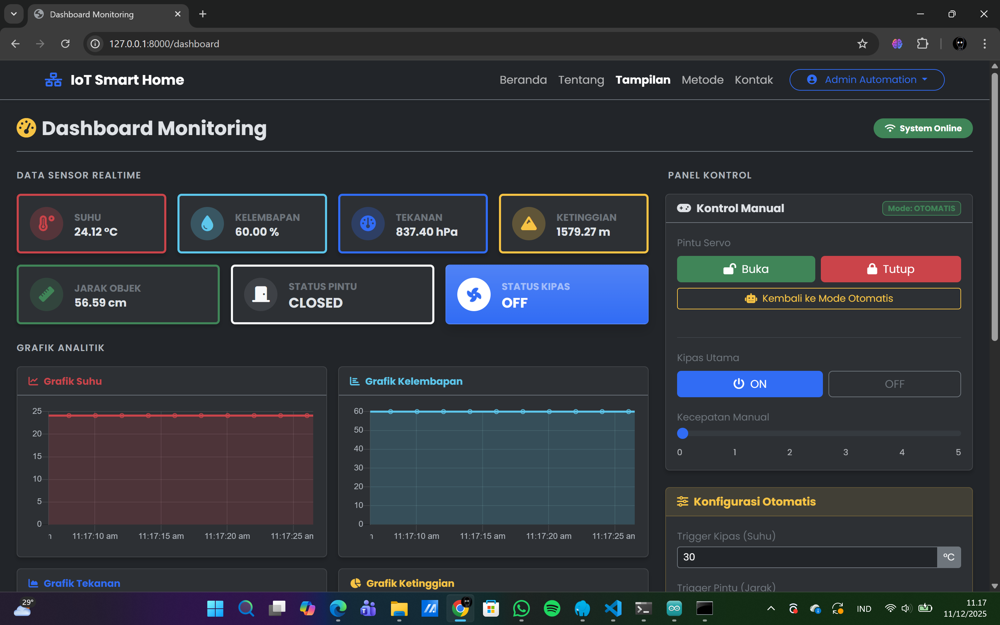
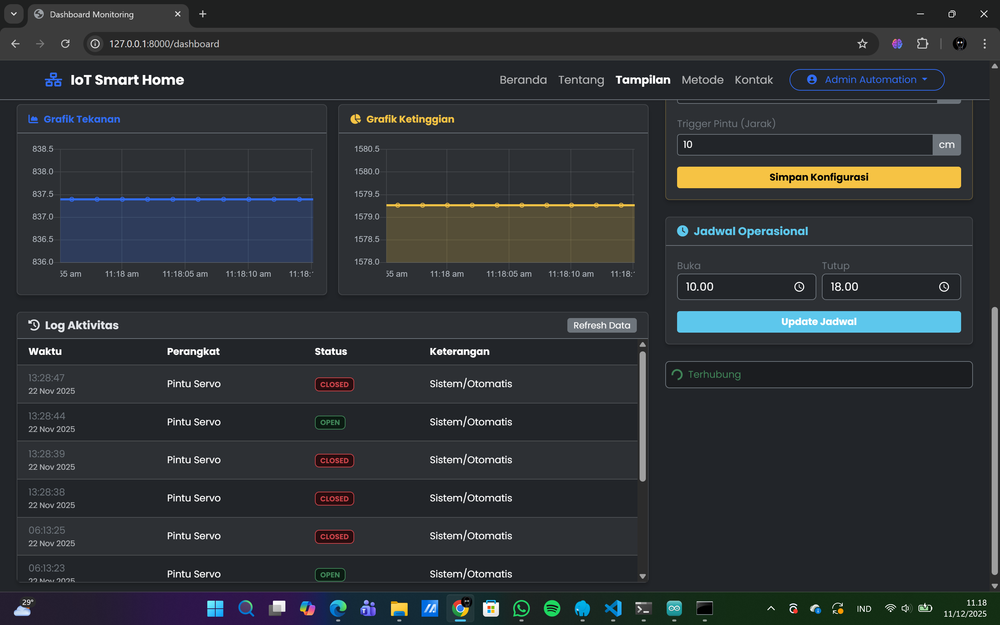
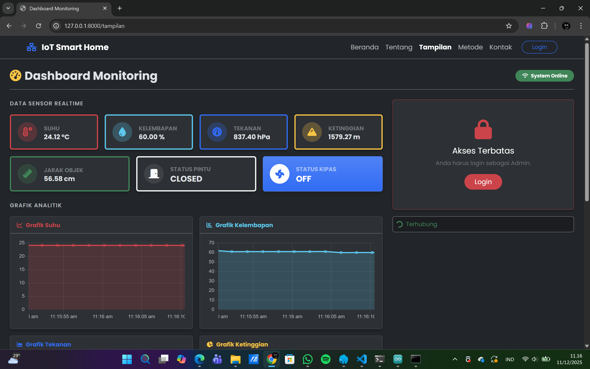
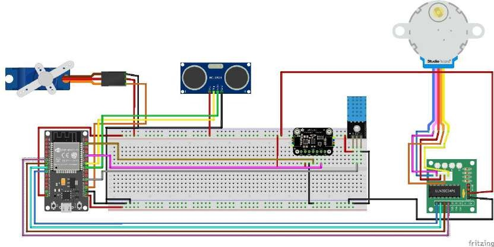

# 🏠 Smart Monitoring & Control Home (IoT)


Sistem Smart Home terintegrasi yang menggabungkan efisiensi **Internet of Things (IoT)** dengan kemudahan pengelolaan via **Web Dashboard**. Proyek ini memungkinkan pemantauan sensor lingkungan secara real-time dan pengendalian prototipe perangkat elektronik (pintu & kipas) melalui protokol MQTT dan framework Laravel.

## 📸 Tampilan Sistem

| Dashboard (Bagian Atas) | Dashboard (Bagian Bawah) |
| :---: | :---: |
|  |  |

| Halaman Dashboard Sebelum Login | Rangkaian Hardware |
| :---: | :---: |
|  |  |

## 🌟 Fitur Utama

* **Hybrid Control Mode:** Perpindahan fleksibel antara mode **Otomatis** (berdasarkan sensor) dan mode **Manual** (via Web Dashboard).
* **Real-time Monitoring:** Visualisasi data sensor (Suhu, Kelembaban, Tekanan Udara, Ketinggian, dan Jarak) yang diperbarui secara instan menggunakan MQTT WebSocket.
* **Time-Based Automation:** Sinkronisasi waktu dengan **NTP Server** untuk pengaturan jadwal buka/tutup pintu otomatis yang presisi.
* **Intelligent Actuator:**
    * Kontrol presisi **Servo Motor** untuk akses pintu.
    * Kontrol kecepatan dinamis pada **Stepper Motor** untuk sistem kipas angin.
* **Data Logging:** Penyimpanan riwayat aktivitas sensor ke database MySQL secara otomatis via Background Service.

## 🛠️ Tech Stack

### Hardware
* **Microcontroller:** ESP32 DevKit V1
* **Sensors:** DHT11 (Humidity), BMP280 (Temperature & Pressure), Ultrasonic HC-SR04 (Distance).
* **Actuators:** MG995 Servo Motor, 28BYJ-48 Stepper Motor + ULN2003 Driver.
* **Protocol:** MQTT (via Mosquitto Broker) & HTTP/NTP.

### Software (Web & Backend)
* **Framework:** Laravel 12
* **Database:** MySQL
* **Messaging:** PHP-MQTT Client & Paho MQTT (JS)
* **Frontend:** Bootstrap 5, Chart.js, & JavaScript (Realtime WebSocket)
* **Firmware:** C++ (Arduino IDE)

## 📁 Struktur Repositori

* `program web/` : Source code aplikasi Web Dashboard (Laravel).
* `monitoring.cpp` : Firmware utama untuk ESP32 (Arduino Sketch).
* `images/` : Dokumentasi gambar proyek.

## 🚀 Panduan Instalasi

### 1. Persiapan Hardware & Firmware
1.  Rakit komponen sesuai dengan pin mapping yang terdefinisi di file `monitoring.cpp`.
2.  Buka `monitoring.cpp`, sesuaikan konfigurasi WiFi dan MQTT Server pada bagian definisi variabel.
3.  Flash/Upload program ke ESP32.

### 2. Persiapan Backend (Laravel)

Pastikan **MQTT Broker (Mosquitto)** sudah dikonfigurasi dan berjalan di server/komputer lokal.

```bash
# 1. Masuk ke direktori web
cd "program web"

# 2. Install library PHP pendukung
composer install

# 3. Konfigurasi Environment
cp .env.example .env

# 4. Generate Application Key
php artisan key:generate
```

### 3. Konfigurasi Database & MQTT (.env)

Buka file .env yang baru saja dibuat, lalu sesuaikan konfigurasi Database dan tambahkan konfigurasi MQTT di bagian bawah file:

```bash
# --- Database Configuration ---
DB_CONNECTION=mysql
DB_HOST=127.0.0.1
DB_PORT=3306
DB_DATABASE=iot_smart_home
DB_USERNAME=root
DB_PASSWORD=

# --- MQTT Configuration (Sesuikan Berdasarkan Konfigurasi Mosquitto) ---
MQTT_HOST=127.0.0.1
MQTT_PORT=1883
MQTT_USERNAME=
MQTT_PASSWORD=

# --- MQTT Configuration (Frontend JS - WebSocket) ---
MQTT_WS_PORT=9001
```

### 4. Menjalankan Aplikasi

Lakukan migrasi database untuk membuat tabel yang dibutuhkan:

```bash
php artisan migrate

# Untuk menjalankan sistem secara penuh, Anda perlu membuka 2 Terminal secara bersamaan:
# Terminal 1: Menjalankan Web Server
php artisan serve

#Terminal 2: Menjalankan MQTT Listener
php artisan mqtt:listen
```

### 5. Akses Dashboard
```bash
Buka browser dan akses alamat berikut: http://localhost:8000